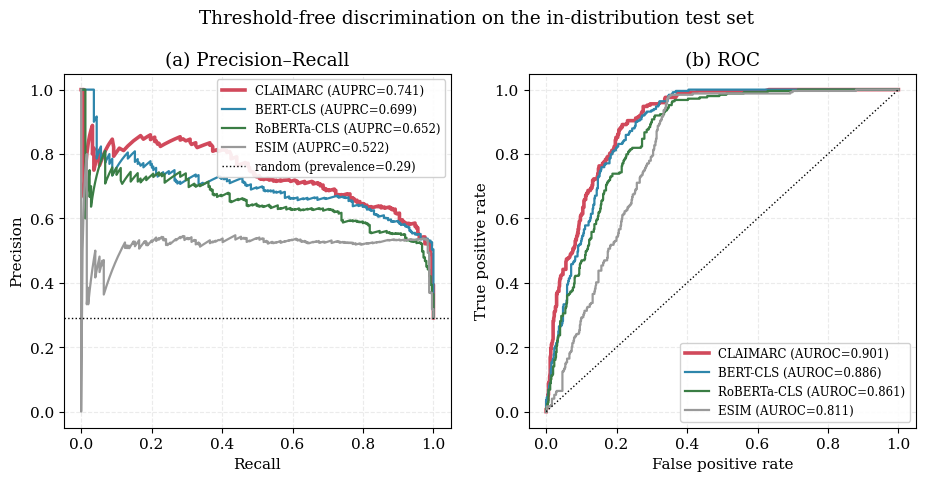
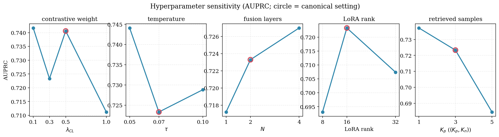
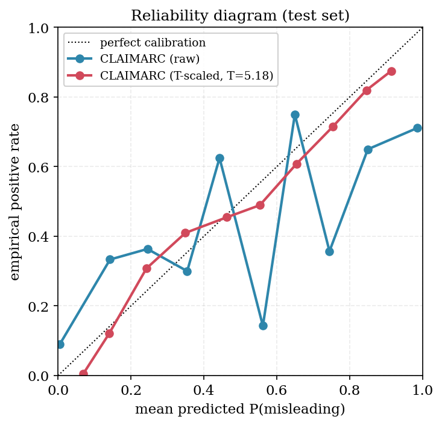

# 直播电商中消费者感知欺骗的检测：一种检索增强对比学习方法

## 摘要

直播电商的高转化率高度依赖主播在限时场景下的话术，而为促成交易做出的夸大承诺、隐性允诺与选择性强调，会增加消费者因承诺与事实脱节而产生负面反馈的风险，对品牌信任与平台合规治理构成挑战。本文在购后评论涉及的可评价商品属性上，同步建模主播宣称与商品事实之间的语义张力，将消费者感知的虚假宣传风险操作化为可由评论证据支持的二值预测目标，并为每条标签附加反映评论支撑强度的可靠性权重。为此提出 CLAIMARC：以共享检索式骨干对主播宣称与商品事实进行双流编码与双向交互，在词元粒度上保留两条语义流的可对照结构；在交叉熵之外引入检索增强对比学习，使表征收紧同标签近邻、推远语义相近的反标签近邻，从而对事实相近、表述差异即引发标签翻转的边界样本具备显式可分性。该设计在部署侧带来可持续优势：编码器训练完成后，仅通过对外部检索库的增量维护即可吸纳新主播、新品类与新风险话术。在自建中文直播电商语料（4,883 条属性级样本）上，CLAIMARC 取得 82.6 的 Accuracy、73.4 的正类 F1、75.4 的 AP 与 90.4 的 AUC，优于同骨干强基线以及覆盖零样本、少样本与监督微调的大语言模型基线；表征几何、跨域迁移与选择性预测分析表明，优势源于学到的检索表征几何而非检索规则本身。研究为平台监管提供可解释、可复核的风险提示，并为商家提供易诱发购后负评的话术风险预警。

**关键词：** 直播电商；虚假宣传检测；消费者感知；检索增强对比学习

## 1 引言

直播电商已成为中国线上零售的核心渠道之一。2024 年中国直播电商交易规模超过 4.5 万亿元人民币，约占网络零售总额的三分之一，并贡献了行业增量的主要部分。高速增长同时伴随消费者投诉与监管处罚的同步攀升：2024 年修订生效的《消费者权益保护法实施条例》与 2025 年《直播电商监督管理办法（征求意见稿）》均把夸大宣传、虚构使用效果与选择性遗漏关键信息列为重点整治对象，并要求平台建立面向直播过程的实时监测与处置机制（State Administration for Market Regulation 2025）。主播在介绍商品过程中产生的虚假宣传已演化为一种系统性合规风险，对消费者权益、品牌信任与平台治理同时构成挑战。

平台对该风险的直接需求，是在主播话术与商品事实之间进行规模化、自动化的差异识别。直播是一种以多轮口播、即时演示与高频互动为特征的高强度说服性沟通：同一切片中往往并存中性事实陈述、带情绪的促销话术、对比与示范展示，并通过节奏、语气与重复动态塑造消费者预期。是否构成虚假宣传并非由单条话术孤立决定，而由话术与商品事实的对照关系、以及消费者据此形成的主观感知共同决定。这一特征使该任务在本质上有别于既有的事实核验或谣言检测，并带来三方面挑战。

**第一，监督锚点的迁移。** 陈述真伪判别在自然语言处理领域积累深厚，从基于自然语言推理的事实核验（Thorne et al. 2018），到面向多源证据的开放域核验（Guo et al. 2022），再到检索增强大模型系统（Putta et al. 2025），已能在已标注的客观陈述上取得较高精度，但其隐含假设是虚假为陈述与事实之间可验证的逻辑矛盾。平台真正承担的风险，更取决于消费者购后是否形成被误导的感受，而非陈述能否被第三方核验为客观不一致；二者在大量样本上并不重合：一类话术虽偏离事实，但若不处于消费者预期的形成路径上，感知风险反而较低；另一类话术字面并无矛盾，却通过选择性强调、对比暗示、重复渲染或风格化背书，构造出消费者收货后才察觉的隐性落差。决定信息不对称缓解效果的是信号可信度而非真伪（Mavlanova et al. 2012），判别因此必须以消费者反馈为锚点。这意味着监督信号由专家标注转向消费者评论，而评论存在自选择（Li and Hitt 2008）、负向偏倚（Baumeister et al. 2001）与促销激励下的真实性问题（Mayzlin et al. 2014; Luca and Zervas 2016; He et al. 2022），唯有经专门的标签构造与可靠性建模才能成为可信任的训练信号；判别单位也由整段口播下沉到具体商品属性，因为购后抱怨通常锚定属性而非整段话术。

**第二，边界样本的同属性内分布。** 用户感知虚假宣传的判别难度，集中体现在词汇与事实高度相似、却被消费者赋予相反标签的样本上。其典型形态包括：事实相同而表述强度不同（如同一款 T 恤，“穿着舒适”与“穿着舒适到不想脱下”客观语义一致，后者却显著抬高预期）；单条话术皆与事实一致、组合却诱导出事实未支持的整体定位（如分别真实的面料、工艺与价格被组合为“专柜级单品”）；以及对购买决策重要的限制条件保持沉默以构造选择性凸显。这些情形的共同结构是：判别信号位于同一属性内部、词汇相近但反馈相反的样本之间，而非跨属性、跨品类的粗粒度差异。把同属性两样本拉入相同表征邻域的判别器（包括基于 pooled representation 的相似度模型与零样本大语言模型）都难以学到此类边界，提示判别器须在表征几何上对同属性内部反标签样本具备显式可分性。

**第三，持续分布漂移与部署节奏。** 直播场景中新主播以日为单位进入平台，新品类与新话术随节令与营销持续涌现，监管点位也逐月调整。面向部署的识别系统须在该动态环境中维持稳定质量，而不能每遇新分布即重训参数化模型。一类自然的替代思路，是把判别决策中可调的成分由模型参数转移到外部检索库——只要表征空间已编码任务的判别几何，少量新样本入库即可在不更新权重的前提下扩展覆盖（Mei et al. 2024, 2025）。该思路已在内容审核中显示出优于参数化分类的跨域稳健性（Wang et al. 2025; Long et al. 2023），但落到本任务仍需回答：检索表征应以何种几何承载消费者感知这一判别轴，其困难负样本又应如何对齐该边界。

CLAIMARC 以单一流水线回应上述需求。它在属性粒度上工作：一侧汇总主播围绕某属性的话术，另一侧将结构化参数、详情图文字与视觉线索拼装为商品事实，对齐后的购后评论给出二值感知标签及其可靠性权重。共享检索编码器以双流读取两侧，并经双向交叉注意力使二者相互改写，在词元粒度保持话术与事实可对照；融合表示同时驱动一个感知风险分类器与一个检索表征。该表征以可靠性加权、类别均衡的对比损失训练，使每个样本向同标签近邻靠拢、远离语义相近的反标签近邻，从而分离措辞相近却标签相反的样本对。部署时编码器固定，新主播或新风险话术只需将其标注样本写入检索库即可被吸纳，并由检索投票与分类器的一致性检验把存疑样本转交人工复核。

本研究的贡献有三。其一，将直播电商虚假宣传识别重新表述为属性级的消费者感知判别，并基于评论构造带实例级可靠性权重的可计算目标，把营销学关于感知欺骗的论述与可扩展的检测方法对接。其二，提出 CLAIMARC，将双流宣称–事实比较与面向有噪评论标签的检索增强对比学习相结合。其三，通过受控基线、表征几何、跨域迁移、消融与选择性预测，表明收益来自学到的表征而非检索规则本身，且固定编码器仅凭索引维护即可适应未见主播。

本文余下部分组织如下。第 2 节梳理与本研究相关的四类文献；第 3 节给出问题形式化、数据构造流程与 CLAIMARC 模型架构；第 4 节描述实验设计与结果分析；第 5 节总结全文并讨论未来研究方向。

## 2 相关工作

本节梳理与本研究相关的四类文献：直播电商中的说服性沟通与误导风险、自动事实核验与 claim–evidence 表征学习、消费者评论作为构念测量信号、以及检索增强对比学习与跨域适应。

### 2.1 直播电商中的说服性沟通与误导风险

围绕直播电商场景下说服性沟通与购买行为的研究多从消费者侧出发，刻画主播个人特质、社交临场感与平台互动机制对观众信任与购买意愿的影响（Wongkitrungrueng and Assarut 2020; Sun et al. 2019; Park and Lin 2020）。在该拟人化、强情境化的渠道中，消费者对主播的认知信任与情感信任会越过商品本身作用于其购买决策，主播的专业人设、互动温度与情绪强度被反复识别为关键前因（Lu and Chen 2021; Hu and Chaudhry 2020）。从信号理论视角看，主播在此承担了远比静态网站要素更具说服力的信号源角色，使信号可信度而非客观真伪成为缓解信息不对称的关键（Mavlanova et al. 2012）。

该信号机制被滥用的可能性近年开始得到正面研究。Cai et al. (2023) 通过对直播间的交互分析提出恶意销售策略分类体系，识别出虚假紧迫性、稀缺感制造与社会从众诱导等典型话术模式，并指出这些策略往往依托平台原生界面放大其说服力。Xiong and Chen (2025) 在演化博弈框架下论证，主播、商家、平台与监管机构间的激励错配是误导性宣传持续存在的结构性原因。与之并行，2024 年以来中国监管机构发布的《直播电商监督管理办法（征求意见稿）》将夸大宣传、虚构使用效果与选择性遗漏关键信息明确列为合规重点（State Administration for Market Regulation 2025）。这些工作在现象与制度层面奠定了基础，但其分析单位主要为主播策略类型或平台监管行为，并未提供可在工业规模上自动判别哪一段话术、在哪个属性上、对消费者构成误导风险的操作化方案。

直接为本研究提供构念支撑的是营销学关于感知欺骗（perceived deception）的研究。Darke and Ritchie (2007) 区分了客观欺骗与消费者感知欺骗，论证后者才是决定品牌长期信任与防御性消费态度的核心变量；Aghakhani and Main (2019) 进一步表明，消费者一旦形成被欺骗的感知，其负面评价会扩展至整个广告品类乃至无关品牌；Riquelme and Román (2014) 在在线零售情境中验证了感知欺骗对回购意愿与电子口碑的负向中介效应。该领域以问卷或实验范式为主，结论虽具理论说服力，但尚未与可大规模部署到直播电商场景的自动检测方法对接，亦未将感知欺骗的边界条件落到主播话术与商品事实的具体对照之上。

### 2.2 自动事实核验与 claim–evidence 表征学习

自动事实核验是与陈述真伪判别最直接对应的研究脉络。Vlachos and Riedel (2014) 早期把事实核验形式化为陈述抽取、证据检索与判定三阶段流水线；FEVER 数据集的发布将任务标准化为基于维基百科证据的支持、反驳与信息不足三分类，并推动了一系列基于自然语言推理（NLI）的判别模型（Thorne et al. 2018; Bowman et al. 2015）。后续研究在证据粒度、跨文档推理与判定可解释性上不断扩展：Augenstein et al. (2019) 提出多领域核验数据集 MultiFC；Wadden et al. (2020) 将场景拓展至科学文献；Schuster et al. (2021) 通过 VitaminC 强调判别器对证据的真实敏感性而非词汇捷径；Guo et al. (2022) 对该谱系做了系统综述。

claim–evidence 交互建模是该谱系中与本研究方法关系最紧的一支。Chen et al. (2017) 提出的 ESIM 通过基于注意力的对齐与组合机制确立了 claim–evidence 局部交互的标准设计；自 BERT 以来的预训练判别模型则通过单流编码与 [CLS] 池化把这类交互内嵌至自注意力中（Devlin et al. 2019）。Li et al. (2025) 针对反讽成因识别提出混合多头融合注意力结构，把双流自注意力与跨流交叉注意力组合在一起，在 BERT 骨干上系统超越单流拼接、双编码器加余弦及 ESIM 等基线，表明当任务本质是两条语义流之间的细粒度对照时，token 级双向交叉注意力能保留单流模型在池化阶段消解掉的结构信号。检索增强大语言模型作为另一条近期路线把外部证据动态接入判别管线（Putta et al. 2025; Vladika and Matthes 2024），主要解决知识时效性问题，其判别机制仍依赖大模型的自回归推理。

该谱系应用于直播电商虚假宣传识别存在三方面不匹配。其一，事实核验默认存在由权威知识库或专家标注定义的客观真值，而本研究的判别对象是消费者购后形成的主观感知偏离，其真值需由评论证据而非外部知识库锚定，相同 claim–evidence 对照在不同表述强度、主播风格与消费者预期下可携带不同标签。其二，NLI 与 FEVER 谱系上的边界样本主要是词汇覆盖近似但语义关系反转的样本，而直播电商场景下的关键边界包括表达强度差异、话术组合误导、选择性凸显与风格化背书等更接近用户认知行为而非命题逻辑的现象。其三，主流核验数据集多为段落级判别，而消费者抱怨几乎总是围绕具体商品属性发出，将不同属性的证据混入同一表征会损失结构信号。

### 2.3 作为构念测量信号的消费者评论

消费者评论作为研究信号的潜力在信息系统、营销学与 NLP 三个领域均有长期积累。自 Hu and Liu (2004) 提出基于属性的产品评论挖掘框架以来，基于属性的情感分析（ABSA）已成为评论数据的标准结构化方式：通过抽取属性词、识别评价句、判定情感极性，将非结构化文本转化为属性级结构化信号（Pang and Lee 2008; Liu 2012）。基于深度学习与弱监督的扩展进一步降低了对人工标注的依赖：Angelidis and Lapata (2018) 利用商品分类与评分作为弱信号联合训练属性抽取与情感预测；Karamanolakis et al. (2019) 仅用少量种子关键词即可在多领域上实现细粒度属性检测。从信息系统视角，Li and Hitt (2008) 揭示了在线评论的自选择问题：早期消费者更可能撰写评论且态度更趋极化，使评论分布并不均匀代表真实消费者群体；这与心理学文献关于负向偏倚的经典论述相互呼应——负面信息相对正面信息具有更高的诊断价值与更深刻的认知影响（Baumeister et al. 2001; Chevalier and Mayzlin 2006）。

评论作为信号同样面临可信度问题。Mayzlin et al. (2014) 通过对 TripAdvisor 与 Expedia 的比较揭示，平台准入约束的强度直接影响促销性虚假评论的密度；Luca and Zervas (2016) 在 Yelp 数据上识别出与竞争压力高度相关的刷评行为；He et al. (2022) 进一步刻画了虚假评论的市场结构。Jindal and Liu (2008) 与 Mukherjee et al. (2013) 从评论文本与评论者行为角度提出了一系列虚假评论识别方法，其判别目标本身即评论是否伪造。在本研究的语境下，关键问题不在于过滤每条评论的真伪，而在于评估属性级标签在多大程度上由可信评论支撑——这是一个关于测量可靠性的问题。Dawid and Skene (1979) 的多评分者模型为这种异质可靠性建模提供了经典框架，其在多源、有噪监督信号下的可靠性加权思路在现代弱监督文献中得到延续（Ratner et al. 2017）。

上述文献为以评论为监督信号的研究确立了两个基本前提：评论可经属性结构化方法被聚合为细粒度信号；评论在自选择、负向偏倚与潜在操纵下并非均质可靠。已有研究多在二者之一的视角下展开——结构化方法侧默认信号干净，可信度方法侧聚焦真伪过滤而非加权聚合。本研究在两者交点处构造属性级监督信号，并以样本级可靠性权重承接 Dawid–Skene 范式中关于异质监督信号的经典处理思路。

### 2.4 检索增强对比学习与跨域适应

监督设定下的对比学习为本研究的表征学习提供了基础。Khosla et al. (2020) 提出监督对比（SupCon）损失，将同标签样本作为正例、不同标签样本作为负例，使表征几何按类聚合；后续工作进一步表明 SupCon 在跨域稳健性与表征几何质量上相对交叉熵具有可重复的优势（Graf et al. 2021）。在该几何下，硬负样本的选择被反复证明是关键变量：Robinson et al. (2020) 在自监督场景下提出硬度倾斜采样；Jiang et al. (2022) 的 H-SCL 把硬度概念引入监督对比；Kim et al. (2024) 的 LAHN 表明，从批内随机采样切换到带动量的标签感知硬负采样可在隐性仇恨言论检测的域内与跨域评估上同时显著提升性能。这些工作共同表明，对比信号的判别力不取决于负样本数量，而取决于负样本是否落在目标判别边界附近。

把检索机制与对比学习耦合的近期工作与本研究方法关系最直接。Karpukhin et al. (2020) 的稠密段落检索把对比学习确立为开放域问答检索表征的事实标准；Gao et al. (2021) 的 SimCSE 与一系列检索预训练骨干（包括本文采用的 BGE 系列）使共享骨干能够同时承担文本理解与近邻检索。Mei et al. (2024) 在仇恨梗图检测中提出检索引导对比学习（RGCL），通过周期性重建 FAISS 索引检索硬负样本，使表征几何对图文间细微替换这类混淆样本具备显式可分性；其后续工作 RA-HMD 把该思路扩展到大型多模态模型的鲁棒适配（Mei et al. 2025）。在工业内容审核场景，基于嵌入的检索系统进一步表明，把审核决策建立在共享表征加标签近邻投票之上，相对参数化分类器在趋势处理与适应性上具备明显优势（Wang et al. 2025; Long et al. 2023）。当任务的判别几何已被对比学习编码进表征空间，新分布的吸纳便由参数重训练问题转化为检索库扩展问题，并在推理时同时获得参数化判定与近邻判定的协同。

与上述工作不同，本研究将消费者评论作为属性级感知风险信号的锚点，把双流双向交叉注意力用作 claim–evidence 比较的结构先验（Chen et al. 2017; Li et al. 2025），并在检索引导对比学习（Khosla et al. 2020; Mei et al. 2024）的基础上，以类别均衡、可靠性加权的方式挖掘正例与困难负例，使对比压力集中在措辞相近而标签相反的样本对上——这正是消费者感知边界所在。推理时进一步由检索式 K 近邻判定与参数化判定协同得到选择性预测，新主播、新品类与新风险样本仅需入库即可影响推理，而无需更新模型权重。

## 3 方法

### 3.1 问题定义

直播电商场景为每个商品 $p$ 提供三类数据流：在直播过程中录制并以时间对齐字幕形式存储的主播口播文本 $T_p$；结构化商品事实集合 $F_p$，由卖家提供的产品参数字典、详情图经 OCR 识别得到的文本以及主图与详情图的视觉内容三部分组成；以及一组购后消费者评论 $R_p=\{r_{p,1},r_{p,2},\ldots\}$，反映消费者实际收到商品后的主观感受。以 $\mathcal{C}$ 表示商品品类集合，并对每个品类定义其标准化属性集合 $A_c$。

记 $A_{\text{cmt}}(p)\subseteq A_{c(p)}$ 为至少被一条 $p$ 的评论评价性提及的属性子集，令 $\mathcal{D}=\{(p,a):p\in P,\,a\in A_{\text{cmt}}(p)\}$ 表示由此得到的「商品–属性」pair 集合。对每个 pair $(p,a)\in\mathcal{D}$：从 $T_p$ 中抽取所有针对属性 $a$ 的主播话术子集，记作 $X^c_{p,a}$；从 $F_p$ 中抽取所有与属性 $a$ 相关的商品事实子集，记作 $X^e_{p,a}$；标签集为 $\mathcal{Y}=\{0,1\}$，其中 $y_{p,a}=1$ 表示属性 $a$ 下主播话术存在用户感知的虚假宣传风险，$y_{p,a}=0$ 表示不存在。检测任务的目标是在单个属性的粒度上联合建模主播话术与商品事实之间的动态交互，学习映射 $f:(X^c_{p,a},X^e_{p,a})\mapsto\hat y_{p,a}\in[0,1]$，使其逼近 $y_{p,a}$。

本研究的核心对象是消费者在直播购物之后形成的误导性感知。此类感知通常体现在评论中对具体商品属性的抱怨、反驳或体验偏差描述之中，因此消费者评论为识别用户感知虚假宣传风险提供了直接的经验依据。基于这一设定，本文以「商品–属性」pair 为基本分析单位，将评论中与属性相关的评价性证据聚合为标签 $y_{p,a}$，并根据评论数量、对齐程度、情感一致性与评论真实性等因素估计 pair 级测量可靠性权重 $c_{p,a}\in[0,1]$。CLAIMARC 随后将该评论侧监督信号与 claim–evidence 判别模型相结合，在商品属性粒度上学习主播话术、商品事实与消费者感知风险之间的关联。

### 3.2 系统架构

CLAIMARC 框架由三部分组成：基于评论证据的标签构造与数据流水线、双流编码器与双向交叉注意力融合模块、以及两个并行任务头并配合检索增强对比学习。数据流水线把三类原始证据转换为以 $(p,a)$ 为分析单位的统一 pair-level 数据集；编码器接受 claim flow 与 evidence flow 两条并行 token 序列；融合模块通过自注意力与双向交叉注意力的多次堆叠建模两条流之间的动态交互；两个任务头联合输出判别概率 $\hat y_{p,a}$ 与检索对齐表征 $\mathbf{g}_{p,a}$。推理阶段将前向判别与检索增强 K 近邻分类器结合，得到带可选弃判的自一致预测结果。下文逐一说明各组件。

#### 3.2.1 数据构造流水线

数据构造流水线分为三个阶段，每阶段对应一类证据源。第一，在每个品类内部完成属性词表的标准化，并把每条评论提及对齐到品类特定的属性 ID：基于卖家提供的参数 key、通过嵌入聚类与大语言模型裁决构造品类属性 schema $\text{CAS}_c$；在 schema 约束下对评论执行开放抽取，将每条评价性提及映射到 $\text{CAS}_c$ 中已有的属性 ID，无法映射时回落到自由生成形式并在后续吸纳进扩展 schema $\text{CAS}_c^+$；每条保留的提及附带极性、证据 span、提及强度以及一个明确事实命中指示，用以指示消费者是在反驳或印证某一被陈述的话术。第二，把主播口播对齐到标准化属性：对每个商品 $p$，以 schema-guided extraction 从带时间戳的口播文本中抽取原子级 claim 片段，并对属性归属与原文 span 一致性施加硬约束；所抽取片段按属性归并为一段 claim passage，随后由独立判定模块判断每条评论是否直接回应了关于该属性的某条具体话术，输出评论级别的二元对齐指示 $y_{\text{align}}$。第三，在同一属性粒度上抽取商品事实证据：通过别名反查并在必要时调用大语言模型兜底从结构化参数字典取证，通过 PaddleOCR 从规格表类详情图提取 OCR 文本再由大模型抽取原文片段，并对主图与典型详情图调用视觉语言模型获取视觉上可直接观察的客观证据；三类来源以并列证据列表形式保留、不做合并裁决，使下游模块能够独立考量每一类证据。流水线最终输出唯一的 pair-level 数据集，每条记录包含标准化属性 ID、带时间戳的主播 claim 片段列表、三类并列的事实证据列表，以及标签构造所需的审计字段。

#### 3.2.2 标签构造与测量可靠性加权

用户感知虚假宣传风险并不以商品整体为单位均匀出现，而往往集中在少数被消费者明确评价的属性上。为获得与这一行为事实一致的监督信号，标签构造程序首先识别评论中与标准化属性相对应的评价性提及，再判断这些提及是否回应了主播围绕同一属性作出的具体 claim。该程序刻画了消费者反馈的两条经验规律：负向评论相对稀疏但具诊断性，正向评论数量充足但更容易受到促销激励、声誉管理或评论操纵的影响（Mayzlin et al. 2014; Luca and Zervas 2016; He et al. 2022）。因此，当且仅当某 $(p,a)$ 至少存在一条评论同时通过对齐校验且持负向极性时，令 $y_{p,a}=1$，否则令 $y_{p,a}=0$。

同一标签值背后的评论证据强度并不相同：有些 pair 得到多条评论的集中回应，有些仅由少量、间接或可疑评论支撑。为将这种测量差异纳入训练，本文为每个 pair 估计测量可靠性权重 $c_{p,a}$，并以逐样本乘子形式进入所有训练损失。权重由四个因子构成：证据饱和因子 $f_{\text{sat}}=1-\exp(-N_{\text{aligned}}/k)$，刻画可靠性随对齐评论数增加而呈现的边际递减，其形式与多评分者测量中的可靠性饱和效应同构（Dawid and Skene 1979）；对齐覆盖率因子 $f_{\text{cov}}=N_{\text{aligned}}/(N_{\text{total}}+1)$，对仅有少数评论实际回应主播话术的 pair 降权，反映在线评论自选择带来的代表性损失（Li and Hitt 2008）；不对称诊断性因子 $f_{\text{asym}}=S_{\text{neg}}/(S_{\text{neg}}+\lambda\cdot S_{\text{pos}})$，仅作用于虚假宣传分支（$y_{p,a}=1$），以 $\lambda<1$ 折扣正向证据，其依据在于消费者通常只有在感知到话术与实物体验存在显著落差时才会围绕具体属性发出抱怨（Baumeister et al. 2001）；评论真实性因子 $f_{\text{fake}}=1-\rho\cdot\mathbb{1}[\text{疑似刷单}]$，仅作用于真实分支（$y_{p,a}=0$），对疑似刷单的 pair 降权，以避免因促销性评论放大正向体验信号而对消费者真实感知造成系统性高估（Jindal and Liu 2008; Mukherjee et al. 2013）。最终权重为

$$c_{p,a}=\begin{cases}\min\!\big(1,\;f_{\text{sat}}\cdot f_{\text{cov}}\cdot f_{\text{asym}}\cdot \phi_{\text{bonus}}\big) & \text{若 } y_{p,a}=1,\\ f_{\text{sat}}\cdot f_{\text{cov}}\cdot f_{\text{fake}} & \text{若 } y_{p,a}=0,\end{cases}$$

并以 $0.05$ 作为下限截断，以保留低可靠性样本对学习信号的边际贡献。当至少一条对齐负向评论携带强提及或明确事实命中信号时，加成乘子 $\phi_{\text{bonus}}$ 被激活，进一步抬升该测量在虚假宣传分支上的诊断权重。

#### 3.2.3 双流输入表示

对每个 pair $(p,a)$，我们构造两条由共享编码器并行处理的 token 序列。Claim flow $X^c$ 编码主播侧证据：起始位置为属性锚点 token，随后接标准化属性名；其后每个 claim 片段以 claim 锚点 token 起始，并以流内分隔符相互分隔；当该属性下没有任何主播话术时插入 null-claim 占位符以保持 batch shape。Evidence flow $X^e$ 编码商品侧证据：起始位置同样为属性锚点与流级 evidence 锚点；其后三类来源（参数、OCR 文本、视觉语言模型观察）各以专属源标识 token 引出，并填入抽取得到的逐字证据条目。两条流的最大长度均为 $L_c=L_e=384$ tokens；超长截断遵循源优先级原则，优先保留参数类证据。

#### 3.2.4 共享编码器

两条流共用同一骨干网络，实例化为 BGE-large-zh-v1.5——一个隐藏维度 $d=1024$、共 24 层 Transformer 的中文语义检索预训练模型，并与融合模块、任务头一道端到端训练。选用检索预训练骨干，使其表征流形与 §3.2.7 的对比学习目标天然对齐。两条流共享参数，一方面因为它们同为同一电商语域的中文文本，另一方面使后续交叉注意力的 query 与 key 落在同一表征流形上，从而可将注意力分数读作话术位置与证据位置之间的对齐度。

#### 3.2.5 双流融合（TwoStreamFusion）

融合模块由 $N=2$ 层结构相同的 block 堆叠而成。每层在 Li et al. (2025) 的混合多头融合注意力基础上做两点扩展：在两个交叉注意力方向之间共享投影权重；用 pre-LayerNorm 替代 post-LayerNorm，使中等规模语料下的训练曲线更稳定。记 $H_c^{(l-1)}$ 与 $H_e^{(l-1)}$ 为进入第 $l$ 层时的 claim 流与 evidence 流上下文表征。每层先对每条流分别执行带残差连接的多头自注意力，得到流内表征 $\tilde H_c^{(l)}$ 与 $\tilde H_e^{(l)}$；再通过双向交叉注意力相互改写两条流：

$$\hat H_c^{(l)}=\text{LN}\big(\tilde H_c^{(l)}+\text{CrossAttn}(Q{=}\tilde H_c^{(l)},K{=}V{=}\tilde H_e^{(l)})\big),$$

$$\hat H_e^{(l)}=\text{LN}\big(\tilde H_e^{(l)}+\text{CrossAttn}(Q{=}\tilde H_e^{(l)},K{=}V{=}\tilde H_c^{(l)})\big).$$

两个方向的 Q/K/V 投影矩阵共享权重，约束融合学到一个对称的 claim–evidence 比较几何，而非两套独立映射；每层最后由一个 position-wise SwiGLU 前馈块加残差连接收尾。每个注意力层有 8 个头、head 维度 $d_{\text{head}}=128$。最终表征 $H_c^{(N)}$ 与 $H_e^{(N)}$ 同时携带属性条件下、相互改写后的上下文状态，其分类 token 位置的表征 $\bar{\mathbf{h}}_c=H_c^{(N)}[\text{CLS}]$、$\bar{\mathbf{h}}_e=H_e^{(N)}[\text{CLS}]$ 汇总了 pair 级交互，并同时驱动两个下游任务头。

#### 3.2.6 并行任务头

两个任务头共享融合表征并联合训练。逻辑回归分类器（LRC）沿用 ESIM 风格的四元组特征构造（Chen et al. 2017），以保留两条流之间的差与积信号：$\mathbf{z}_{p,a}=[\bar{\mathbf{h}}_c;\,\bar{\mathbf{h}}_e;\,\bar{\mathbf{h}}_c-\bar{\mathbf{h}}_e;\,\bar{\mathbf{h}}_c\odot\bar{\mathbf{h}}_e]\in\mathbb{R}^{4d}$，经 LayerNorm 与单层仿射映射输出判别概率 $\hat y_{p,a}=\sigma(\mathbf{w}^\top\text{LN}(\mathbf{z}_{p,a})+b)$，其分类损失为 pair 级加权二元交叉熵：

$$\mathcal{L}_{\text{CE}}=-\sum_{(p,a)}c_{p,a}\big[y_{p,a}\log\hat y_{p,a}+(1-y_{p,a})\log(1-\hat y_{p,a})\big].$$

检索表征头（RetrEmb）通过一个带 GELU 激活的两层 MLP 把 pair 表征投影到 256 维单位超球面：$\mathbf{g}_{p,a}=\text{L2Norm}\big(\text{MLP}_{\text{ret}}([\bar{\mathbf{h}}_c;\,\bar{\mathbf{h}}_e])\big)\in\mathbb{R}^{256}$。

#### 3.2.7 检索增强对比学习

若硬负样本仅在 batch 内随机采样，对比学习往往沿品类等粗粒度信号区分样本，而这并非任务所需的判别轴：在同一属性内部，两件商品的事实可能近乎相同，主播话术上的细微差异却足以翻转标签。我们因此采用检索增强对比学习（RACL），通过周期性重建的索引检索与 anchor 标签相反且语义相近的困难负例，使对比压力自动落在标签翻转的边界邻域。每个 epoch 开始前对训练集做一次前向，把检索表征 $\mathbf{g}$ 写入记忆库。对带标签 $y_i$ 的 anchor $i$，正例集 $\mathcal{P}_i$ 取其同标签最近的 $K_p=3$ 个邻居，困难负例集 $\mathcal{N}_i$ 取其反标签最近的 $K_n=5$ 个邻居。按可靠性与逆频类别均衡加权的 InfoNCE 风格对比损失为

$$\mathcal{L}_{\text{CL}}=\sum_i\frac{c_i\,b_{y_i}}{|\mathcal{P}_i|}\sum_{j\in\mathcal{P}_i}-\log\frac{\exp(\mathbf{g}_i^\top\mathbf{g}_j/\tau)}{\exp(\mathbf{g}_i^\top\mathbf{g}_j/\tau)+\sum_{k\in\mathcal{N}_i}\exp(\mathbf{g}_i^\top\mathbf{g}_k/\tau)},$$

温度 $\tau=0.07$，$b_{y_i}$ 为逆频类别均衡因子，避免占比约 26% 的误导类被多数类淹没。该目标塑造检索空间，使语义相近而标签相反的样本对沿消费者感知风险的边界被推开。

#### 3.2.8 两阶段微调

联合训练目标由分类损失、对比损失与权重衰减项组合而成：$\mathcal{L}=\mathcal{L}_{\text{CE}}+\lambda_{\text{CL}}\mathcal{L}_{\text{CL}}+\lambda_{\text{reg}}\|\Theta_{\text{trainable}}\|_2^2$，默认系数 $\lambda_{\text{CL}}=0.5$、$\lambda_{\text{reg}}=10^{-4}$。该目标分两阶段优化：Stage 1（热身，3 个 epoch）仅启用分类项、将对比系数置零，使编码器、融合模块与任务头先收敛到一致的属性级判别几何，再引入 retrieval-aware 表征；Stage 2（6 个 epoch）启用完整目标并在每个 epoch 末重建 FAISS 索引。该两阶段分离方案可避免快速任务适配与表征对齐两个目标在全程联合优化时的冲突（Mei et al. 2025）。模型使用 AdamW 优化器（$\beta_1=0.9,\beta_2=0.999$、weight decay $0.01$）；编码器学习率 $1\times10^{-5}$，融合模块与任务头学习率 $1\times10^{-4}$；调度采用 200 步线性 warm-up 后线性衰减；梯度裁剪上限 1.0；混合精度采用 bfloat16；有效 batch size 为 36。所有实验报告 3 个随机种子的均值与标准差。

#### 3.2.9 推理流水线

推理阶段，测试 pair 先经编码器、融合模块与分类头一次前向，得到判别概率 $\hat y_t$ 与检索表征 $\mathbf{g}_t$。随后由检索增强 K 近邻分类器（RKC）在训练集 FAISS 索引上检索 $\mathbf{g}_t$ 的 $K_R=10$ 个最近邻，并执行带相似度与测量可靠性加权的投票：

$$\hat y_t^{\text{RKC}}=\frac{\sum_{j\in\text{kNN}(t)}c_j\cdot\cos(\mathbf{g}_t,\mathbf{g}_j)\cdot y_j}{\sum_{j\in\text{kNN}(t)}c_j\cdot\cos(\mathbf{g}_t,\mathbf{g}_j)}.$$

RKC 作为独立于前向判别的检索式估计，利用对比目标塑造的嵌入空间；默认推理以前向分类器为主预测路径，RKC 用于免梯度的新域吸纳（§4.5）与选择性预测。两个估计通过自一致规则结合：当 $|\hat y_t-\hat y_t^{\text{RKC}}|>\delta$（取 $\delta=0.3$）时弃判并标记为需人工复核，否则取两者均值阈值化输出。弃判不作为主决策通道，而用于支持选择性预测分析。

## 4 实验结果与分析

本章实验围绕四个研究问题展开。**RQ1**：在主分布上，CLAIMARC 能否稳定优于客观事实核验、文本分类、冻结编码器检索探针与大语言模型四类基线？**RQ2**：检索增强对比学习（RACL）能否在话术与事实高度相似、却因细微差异引发相反感知标签的边界样本上塑造出可分的表征？**RQ3**：模型能否迁移到未见的品类与主播？冻结编码器的检索库能否在不重训参数的前提下吸纳新域？**RQ4**：各组件、检索策略与超参选择对最终性能各有多大贡献、是否稳健？下文 §4.4 回应 RQ1，§4.5 回应 RQ3，§4.6 回应 RQ2，§4.7 至 §4.9 回应 RQ4 并考察模型的部署表现。

### 4.1 数据集与描述性统计

实验语料覆盖 2024 年 10 月至 2025 年 3 月采集的中文直播电商数据。经 §3.2.1 数据流水线（品类内属性标准化、主播话术对齐、三源商品事实抽取）处理后，每条实例对应一个（商品，属性）pair。除由评论驱动得到感知标签的 pair 外，我们另行挖掘**客观负例**（objective-negative）pair，即主播确有口播、但无任何对齐消费者评论的属性；这类样本不携带感知误导信号（$y=0$），并按商品侧证据覆盖度加权。最终数据集共 **4,883** 条 pair，覆盖 10 个一级品类、38 个二级品类、108 个直播间、1,532 个标准化属性，其中评论驱动样本 2,278 条、客观负例 2,605 条，整体正例（感知误导）占比 **25.6%**。可见本任务是一个典型的类别偏倚筛查问题。

我们按 room_id 分组、以 70:10:20 切分 train/val/test，并使同一直播间的全部 pair 严格落入同一划分，从根本上杜绝主播身份泄漏（Table 1）。三个划分的正例率分别为 24.2%、31.1% 与 29.1%，分布足够接近，可将测试集视为有代表性的样本。证据来源覆盖度（三类商品事实来源中同时命中的个数为 0/1/2/3）对应 1,483 / 1,826 / 1,118 / 456 条，平均 1.11；逐 pair 的实例级可靠性权重 $c_{p,a}$ 均值 0.456、中位数 0.48，主体落于 [0.18, 0.82]。主播话术片段平均约 23 字、商品事实文本约 22 字；46.7% 的 pair 至少对齐 1 条相关消费者评论，平均每条 pair 对齐 6.9 条、其中 1.5 条为负向，构成感知标签的经验依据。品类分布见 Table 2，呈服饰、母婴与通用类居多的长尾结构，而这一长尾正是 §4.5 跨品类迁移所要施压的对象。

**Table 1.** Room-grouped partitions (70:10:20 by room_id). Review-driven: 2,278; objective-negative: 2,605. Evidence-source coverage (0/1/2/3): 1,483/1,826/1,118/456 (mean 1.11). Reliability weight $c$: mean 0.46, median 0.48.

| Split | #Pairs | Pos. % | #Rooms |
|---|---:|---:|---:|
| Train | 3,636 | 24.2 | 92 |
| Validation | 392 | 31.1 | 5 |
| Test | 855 | 29.1 | 11 |
| **All** | **4,883** | **25.6** | **108** |

**Table 2.** Category distribution (10 first-level categories).

| Category | #Pairs | Category | #Pairs |
|---|---:|---|---:|
| apparel_and_underwear | 1,274 | smart_home | 324 |
| general | 827 | digital_and_electronics | 270 |
| baby_kids_and_pets | 715 | sports_and_outdoor | 262 |
| shoes_and_bags | 476 | beauty_and_personal_care | 225 |
| food_and_beverages | 426 | jewelry_and_collectibles | 84 |

### 4.2 基线设置

我们设置四类基线，分别用以排除一种可能的替代解释。所有系统在相同划分、相同输入预算、相同可靠性加权监督、相同验证集选阈值下训练或评估；非大模型系统均在单张 24G RTX 4090 上完成。

**（A）客观事实核验。** 这一类刻画把监督锚点设为话术与证据间是否存在可机械验证的逻辑矛盾时所能达到的判别上限，覆盖成对蕴含建模的常见谱系：ESIM（Chen et al., 2017；BiLSTM 加注意力软对齐、差积组合与池化）、以注意力"对齐—比较—聚合"取代循环结构的 Decomposable Attention（Parikh et al., 2016，一种标准的非循环 NLI 基线），以及联合读取话术与证据的中文 BERT-NLI 跨编码器。

**（B）文本分类。** 这是与本方法最接近的一类。从零训练的神经基线为 TextCNN（Kim, 2014）与带池化的 BiLSTM；单流微调编码器 BERT-base-chinese 与 Chinese-RoBERTa-wwm-ext 以 `[CLS] X^c [SEP] X^e [SEP]` 输入、由 `[CLS]` 隐式承载话术与证据的对照，其中全词遮蔽的 RoBERTa 用以排除骨干容量不足这一混淆解释。

**（C）冻结编码器检索探针。** 这一类检验在任何对比训练之前，表征里已经蕴含了什么：在冻结 BGE 成对特征上分别训练逻辑回归、线性 SVM 与 MLP，以及在冻结 BGE 嵌入上做可靠性加权的 $k$ 近邻投票。其中的 $k$ 近邻投票把 CLAIMARC 的推理规则原样搬到未经训练的表征空间，是检验 RACL 价值最紧的对照。

**（D）大语言模型。** 这一类考察通用大模型在零样本、少样本与同等监督微调三种条件下的能力边界，包含四个网关大模型（GPT-5.4、Qwen-Flash、Gemini-3.5-Flash、Kimi-K2.6）在零样本与五样本思维链（CoT）下的判定（统一将属性、主播话术与商品事实并列输入，不提供消费者评论与弱标签），以及 Qwen2.5-7B-Instruct + LoRA 监督微调——在与 CLAIMARC 完全相同的训练集与监督信号上做指令式二分类微调。

### 4.3 评估指标

识别消费者感知误导，本质上是一个类别偏倚、面向排序的筛查问题：正类为少数，部署时的目标是把风险话术排序后交合规审核优先处理。为保证各表口径一致、便于横向比较，我们对所有分类实验统一汇报一组能直接反映筛查效用的指标。其中两项与阈值无关：AP（average precision，即 precision–recall 曲线下面积，亦记 AUPRC）为主指标，是正例稀疏时排序质量的规范度量；AUC（即 AUROC）刻画阈值无关的可分性。另两项与阈值相关：Accuracy 与正类 F1（记 F1$_{pos}$），二者均在验证集上选定单一阈值后，原样应用于测试集。配对显著性以 $n=2,000$ 的配对 bootstrap 在测试集预测上估计。

**实现细节。** 共享骨干为 BGE-large-zh-v1.5（$d=1024$），与融合模块、任务头一道端到端训练。TwoStreamFusion 堆叠 2 个 pre-LN 块（8 头、共享双向交叉注意力、SwiGLU 前馈）。训练分两阶段：先以 3 个 epoch 的可靠性加权二元交叉熵热身，再以 6 个 epoch 引入权重为 $\lambda_{CL}$ 的 RACL；取 $\lambda_{CL}=0.5$、$\tau=0.07$、$K_p=3$、$K_n=5$。优化采用 AdamW，编码器学习率 $1\times10^{-5}$、头部学习率 $1\times10^{-4}$、bf16 精度、有效批量 36。推理侧 CLAIMARC 采用前向分类器（CLS）出分，各表头条指标即取自该分类器；检索增强 $K$ 近邻投票（RKC）不参与默认推理，而用于免梯度的新域吸纳（§4.5）与配合 CLS 支持人工弃判的选择性预测（§4.9）。所有可学习系统——CLAIMARC、各微调编码器与从零训练的神经基线——均在 3 个随机种子（0、1、2）下训练。跨域实验（Table 4）中，留一品类协议汇报跨 10 折的均值与标准差，留 20 主播协议汇报跨 3 个种子的均值与标准差。

### 4.4 主对比（RQ1）

CLAIMARC 在 Table 3 的四项指标上全部领先（Accuracy 82.6、F1$_{pos}$ 73.4、AP 75.4、AUC 90.4），且优势最大处恰在筛查最看重的两项排序指标：在同等端到端微调预算下，AP 由最强微调编码器 RoBERTa-CLS 的 69.0 提升至 75.4，较 BERT-CLS（68.2）亦高出 7.2，F1$_{pos}$ 较 BERT-base（71.7）高出 1.7。四类基线各自说明了原因。客观事实核验落后最远——ESIM 的 AP 仅 51.2，即便联合读取话术与证据的 BERT-NLI 跨编码器也止步 67.9——这印证了消费者事后判为误导的话术极少在机械意义上与证据相矛盾，专为检测逻辑矛盾而设的模型因而无从着力。文本分类一族中，从零训练的序列模型（TextCNN 60.9、BiLSTM 66.3）明显落后于预训练编码器，说明检索预训练骨干贡献的是真正的判别能力，而非单纯的容量。大模型的表现最为醒目：零样本与五样本下其排序退化到随机水平（AP 27–29、AUC ≤ 0.50），即便给予同等监督，经 LoRA 微调的 Qwen2.5-7B 也只把 AP 恢复到 63.8，仍以约二十倍的参数量落后 CLAIMARC 逾 10 个 AP，可见通用参数化先验并未编码消费者感知这一判别轴。最后，冻结探针定位了增益的来源：把 CLAIMARC 的可靠性加权 $k$ 近邻投票原样搬到未经对比训练的冻结 BGE 成对嵌入上，AP 仅 64.4，最强的非对比探针（MLP）也只到 67.6——检索表征本身并不足够，优势唯有在对比训练重塑几何之后才出现。与此一致，Figure 1 显示 CLAIMARC 恰在筛查实际工作的高召回区段拉开差距。

**Table 3.** Main comparison on the test set (%, $N=855$, 249 positives) across 14 baselines in four groups. Trainable systems report mean ± s.d. over three seeds; the frozen-encoder probes and the language models are run once. Accuracy and F1 use a validation-selected threshold; AP and AUC are the primary threshold-free metrics. All gateway LLMs in zero-shot/5-shot score AP 27–29 and AUC ≤ 0.50; representative rows are shown. Best per column in bold.

| Group | System | Acc | F1 | AP | AUC |
|---|---|---:|---:|---:|---:|
| (A) Objective fact verification | ESIM | 73.8 | 65.9 | 51.2 | 79.9 |
|  | Decomposable Attention | 76.2 | 61.5 | 60.5 | 83.6 |
|  | BERT-NLI cross-encoder | 79.1 | 65.1 | 67.9 | 87.4 |
| (B) Text classification | TextCNN | 76.5 | 57.0 | 60.9 | 84.1 |
|  | BiLSTM | 79.2 | 65.5 | 66.3 | 86.4 |
|  | BERT-base + [CLS] | 80.9 | 71.7 | 68.2 | 88.3 |
|  | RoBERTa-wwm + [CLS] | 80.5 | 70.0 | 69.0 | 88.4 |
| (C) Frozen-encoder retrieval probes | BGE-frozen + LR | 77.0 | 68.5 | 66.4 | 86.6 |
|  | BGE-frozen + linear SVM | 76.0 | 68.0 | 60.5 | 84.8 |
|  | BGE-frozen + MLP | 78.6 | 67.4 | 67.6 | 86.4 |
|  | BGE-frozen + kNN vote | 78.1 | 62.1 | 64.4 | 83.0 |
| (D) Large language models | Qwen-Flash (0-shot) | 49.8 | 30.5 | 27.4 | 46.1 |
|  | GPT-5.4 (5-shot CoT) | 58.2 | 24.8 | 26.9 | 44.6 |
|  | Qwen2.5-7B + LoRA SFT | 73.0 | 61.7 | 63.8 | 81.9 |
| **CLAIMARC** | forward classifier (ours) | **82.6** | **73.4** | **75.4** | **90.4** |

### 4.5 跨域泛化（RQ3）

筛查模型只有在新品类与新主播不断涌入时仍然稳健，才真正可用，因此我们接着检验向未见域的迁移，且不做任何目标域适应、CLAIMARC 的检索库仅由源域样本构成（Table 4）。当整个品类被留出时（依次留出 10 个一级品类、对 10 折取均值），CLAIMARC 不仅在未见品类上排序最佳（AUC 90.0、AP 71.0），跨折波动也最小（AUC 标准差 4.0，对照 BERT-CLS 的 4.7），说明其优势并不取决于恰好见到哪个品类。留出 20 个主播则把差距进一步拉大（AUC 93.1、AP 81.4，AP 较最强微调编码器高出约 2.5 个点）——当判别轴是消费者感知而非主播身份时，这一结果正在意料之中。相比之下，大模型在两种协议下始终停留在随机附近或以下（AUC ≤ 0.52），再次表明其参数化先验几乎不承载这一判别轴。

**Table 4.** Cross-domain generalization (%) under two protocols, reporting AUC and AP. All systems train on the source and test on an unseen target with no target adaptation; CLAIMARC's retrieval library is built only from the source pairs. In-domain reference AP is 75.4 (§4.4). Best per column among the learned systems within each panel in bold.

| System | Leave-1-cat. AUC | Leave-1-cat. AP | Leave-20-str. AUC | Leave-20-str. AP |
|---|---:|---:|---:|---:|
| ESIM | 85.1 ±6.7 | 56.5 ±12.2 | 88.2 ±0.4 | 68.4 ±0.7 |
| BERT-CLS | 89.4 ±4.7 | 70.1 ±8.0 | 92.2 ±0.0 | 78.7 ±0.3 |
| RoBERTa-CLS | 88.5 ±4.3 | 67.3 ±6.7 | 92.0 ±0.2 | 78.9 ±0.8 |
| LLM zero-shot | 45.2 ±5.1 | 25.6 ±12.6 | 47.0 ±0.3 | 29.3 ±0.2 |
| LLM 5-shot CoT | 45.6 ±4.5 | 25.7 ±12.1 | 52.1 ±0.8 | 32.4 ±0.9 |
| **CLAIMARC** | **90.0 ±4.0** | **71.0 ±5.5** | **93.1 ±0.3** | **81.4 ±1.3** |

上述比较把每个系统都冻结、在目标域上只读一次。但本框架的主张更强：冻结的 CLAIMARC 无需任何梯度更新，仅靠维护检索索引即可在新域上持续改善。我们在主播迁移协议下直接检验这一点：编码器在源域直播间训练后冻结，将留出主播的标注样本按比例逐步写入检索库，并在**从不写入**的另一半留出主播上重新读取检索投票；前向分类器全程固定，作为无法在不重训下吸纳新主播的"零适配"参照。如 Table 5 所示，唯一可适配的检索投票随索引填充单调上升，AP 由仅含源域库的 65.5 升至全量目标覆盖时的 71.5（+6.0），AUC 由 80.3 升至 84.8（+4.5），且增益平滑早现——仅写入五分之一目标样本即可获得约一半增益。这一结果刻画了部署侧的核心机制：**当出现训练时未见的新主播或新风险话术时，无需重训模型，只需将少量种子样本编码后写入检索库，KNN 检索路径即可借助新入库的同类近邻重新校准投票，从而提升对该类样本的判别准确性。** 其前提是 RACL 已将嵌入空间塑造为感知风险结构在局部一致——同类样本彼此邻近——因而向目标邻域注入少量样例便足以改变投票结果。由此，跨域适配从"参数重训练"问题转化为"索引维护"问题。

**Table 5.** Gradient-free library adaptation under leave-20-streamers transfer (%, mean ± s.d. over 3 seeds). The encoder is frozen after source training; a growing fraction of the held-out streamers' labelled pairs is written into the retrieval library, and the retrieval vote is read on the disjoint, never-written half. The vote—the only adaptable component—improves monotonically with library coverage and overtakes the frozen forward classifier on F1 at full coverage, without any gradient step.

| Retrieval library on held-out streamers | AP | AUC | F1 |
|---|---:|---:|---:|
| Frozen forward classifier (no adaptation) | 81.1 ±0.9 | 93.1 ±0.3 | 73.5 ±2.9 |
| source pairs only | 65.5 ±1.8 | 80.3 ±2.6 | 72.4 ±1.9 |
| + 20% of target pool | 67.5 ±1.1 | 81.3 ±2.2 | 73.3 ±1.9 |
| + 40% | 69.0 ±1.2 | 82.7 ±1.7 | 73.8 ±2.6 |
| + 60% | 69.7 ±1.0 | 83.3 ±1.8 | 73.6 ±2.4 |
| + 80% | 70.7 ±1.2 | 84.3 ±1.6 | 74.4 ±2.6 |
| + 100% of target pool | **71.5 ±1.5** | **84.8 ±1.5** | **74.9 ±2.5** |

### 4.6 表征几何与边界敏感性（RQ2）

若增益确实来自表征，那它应当显现在标签几何上。我们固定骨干、分类头与超参数，只改变对比目标——无对比（仅 BCE）、标准监督对比 SupCon（Khosla 等，2020，批内同标签互为正例、异标签为负例，无检索与困难挖掘）以及本文的 RACL（Table 6）。RACL 给出最清晰也最稳定的分离，把 label silhouette 提升至 0.422，高于 SupCon 的 0.349 与无对比的 0.196。与 SupCon 的对比更具说明性：SupCon 取得最紧的 alignment，但 uniformity 最低（−0.86），是空间部分塌缩的征兆；RACL 则在保持空间展开（−1.21）的同时仍拉开两类——这正是检索投票与库更新所依赖的几何。两种对比目标都把 hard-region purity@10 由 0.500 提升至 0.573，说明改善恰恰集中在语义相近但标签相反的近邻处。Figure 3 的 UMAP 投影给出了一致的可视化：无对比时两类大范围交织，SupCon 增强同类聚集，RACL 则进一步分离出清晰的高风险聚集区。

**Table 6.** Label-conditional geometry of the test retrieval embedding under three contrastive objectives sharing an identical BGE-full-fine-tuning backbone, classifier and hyper-parameters (3-seed mean±s.d.; metrics are attribute-free, with the train split as the retrieval index). RACL attains the best and most stable label silhouette; standard SupCon reaches the tightest alignment but at the cost of a collapsed (least uniform) space, whereas RACL preserves uniformity while separating the classes.

| Variant | Silhouette | Hard-region purity@10 | Alignment | Uniformity |
|---|---:|---:|---:|---:|
| w/o contrast | 0.196±0.053 | 0.500±0.043 | 1.121 | −2.02 |
| SupCon | 0.349±0.173 | **0.573±0.017** | **0.478** | −0.86 |
| **RACL** | **0.422±0.010** | **0.573±0.088** | 0.905 | −1.21 |

### 4.7 消融实验（RQ4）

为弄清究竟是哪些设计选择支撑了结果，我们以默认配置为基准、每次只改动一处，并始终读取前向分类器以保证各行可比。三张专表依次考察学习目标与骨干、双流架构，以及对比该检索什么。

**目标、加权与骨干（Table 7）。** 没有哪个组件是可有可无的：每次移除都同时拉低操作点与排序质量。对比目标与可靠性权重的作用最大，分别在移除时损失 3.3 与 3.2 个 AP，说明学到的几何与对噪声敏感的监督贡献大致相当。类平衡因子带来更小但确凿的 1.5 个 AP；而把 ESIM 式四元组 $[h_c,h_e,h_c-h_e,h_c\odot h_e]$ 坍缩为朴素拼接损失 3.6 个 AP，可见显式的差/积特征并未被融合所携信息覆盖。把检索预训练的 BGE 换成同等规模的 BERT-base 损失 4.3 个 AP——单项最大跌幅——这把增益定位在骨干的检索预训练而非原始容量上。

**为何需要两条对照流（Table 8）。** 两条流的作用并不对称却彼此互补。仅证据流的模型崩溃至 48.4 AP，仅略高于正例率，因为商品事实本身说明不了话术是否抬高了预期；仅话术流稍好，却仍让出 5.0 AP，可见一旦有话术可供对照，证据流便开始发挥作用。在两条流俱在的前提下，移除交叉注意力融合是对操作点损害最大的改动（F1 损失 4.6），这证实了真正把话术与其证据对齐的是跨流交互，而非简单地同时获得两段文本。两条流及其交互缺一不可。

**对比该检索什么（Table 9）。** 此处的问题是如何挖掘对比样例，两点结论尤为突出。把伪金正例（相似度最高的同标签近邻）换成常规的困难正例并无助益、且略降 F1，与 RGCL 报告的困难正例不稳定现象一致（Mei et al. 2024）。限制负例——无论限于同属性还是同证据类型——都不曾胜过更简单的类别均衡采样，故默认保留后者。正例数量基本不敏感（$K_p\in\{1,3,5\}$ 均在噪声之内），困难负例数量则有明显最优值五：过少（损失 1.3 F1）对边界约束不足，过多（损失 4.2 F1）则开始引入噪声近邻。

**Table 7.** Core objective, weighting, and backbone components, removed one at a time (%, forward classifier, mean ± s.d. over three seeds; canonical in bold). Every removal lowers both the operating point and the ranking metric.

| Variant (CLAIMARC, forward) | Acc | F1 | AP | AUC |
|---|---:|---:|---:|---:|
| **Canonical CLAIMARC** | **82.6 ±0.4** | **73.4 ±0.5** | **75.4 ±1.3** | **90.4 ±0.4** |
| w/o RACL contrast | 81.2 ±1.1 | 70.8 ±2.0 | 72.1 ±2.3 | 89.4 ±0.9 |
| w/o reliability weight c | 81.6 ±1.3 | 71.6 ±1.6 | 72.2 ±3.1 | 89.5 ±0.7 |
| w/o class-balanced contrast | 82.1 ±0.5 | 72.7 ±1.9 | 73.9 ±0.4 | 89.9 ±0.2 |
| w/o ESIM 4-tuple head | 81.4 ±0.6 | 72.0 ±1.7 | 71.8 ±2.3 | 89.4 ±0.5 |
| backbone: BGE → BERT | 81.2 ±0.6 | 72.4 ±0.9 | 71.1 ±1.4 | 89.2 ±0.4 |

**Table 8.** Necessity of two contrasting streams (%, forward classifier, mean ± s.d. over three seeds; canonical in bold). A single stream cannot read the claim–evidence relation: the evidence-only model collapses to near-prevalence AP, and even with both streams the cross-attention fusion is needed for the operating point.

| Stream design | Acc | F1 | AP | AUC |
|---|---:|---:|---:|---:|
| **Dual-stream + TwoStreamFusion** | **82.6 ±0.4** | **73.4 ±0.5** | **75.4 ±1.3** | **90.4 ±0.4** |
| Dual-stream, w/o fusion (concat) | 80.7 ±0.5 | 68.8 ±3.2 | 73.8 ±1.4 | 89.6 ±0.4 |
| Claim stream only (no fusion) | 81.1 ±1.0 | 73.0 ±0.3 | 70.4 ±1.9 | 89.2 ±0.1 |
| Evidence stream only (no fusion) | 68.7 ±0.8 | 44.1 ±4.3 | 48.4 ±0.4 | 68.7 ±1.2 |

**Table 9.** Retrieval-augmented contrast: positive/negative mining (%, forward classifier, mean ± s.d. over three seeds; canonical in bold). Pseudo-gold positives beat hard positives, restricting negatives never helps, and the hard-negative count has a clear optimum at five.

| RACL retrieval design | Acc | F1 | AP | AUC |
|---|---:|---:|---:|---:|
| **Pseudo-gold pos., global hard neg. (Kp3/Kn5)** | **82.6 ±0.4** | **73.4 ±0.5** | **75.4 ±1.3** | **90.4 ±0.4** |
| hard positives (vs pseudo-gold) | 81.9 ±1.1 | 73.0 ±0.7 | 73.7 ±0.7 | 90.0 ±0.2 |
| same-attribute negatives | 82.1 ±0.4 | 72.6 ±1.3 | 73.5 ±0.5 | 90.0 ±0.0 |
| same-evidence-type negatives | 81.8 ±0.3 | 72.7 ±1.5 | 74.0 ±0.5 | 90.0 ±0.1 |
| positives Kp=1 | 82.5 ±0.7 | 73.4 ±0.6 | 74.0 ±0.7 | 89.9 ±0.2 |
| positives Kp=5 | 82.4 ±0.5 | 73.4 ±0.2 | 73.7 ±0.5 | 90.0 ±0.1 |
| hard negatives Kn=1 | 81.4 ±0.4 | 72.1 ±1.4 | 73.6 ±0.2 | 90.0 ±0.1 |
| hard negatives Kn=10 | 81.1 ±0.3 | 69.2 ±2.3 | 73.5 ±0.4 | 89.9 ±0.1 |

**可靠性权重的构造是否站得住脚？** 既然 $c_{p,a}$ 会移动头条指标，一个公允的问题是：它的具体形式是否必要，还是任何对低信号样本的下采样都同样奏效？为此我们只扰动逐样本的训练权重 $w_{p,a}$，而架构、数据与验证/测试权重保持不动，使阈值与加权指标在各行间可比（Table 10）。这些扰动恰好隔离出该设计的三条性质。其方向是有信息的：移除权重损失 2.2 F1，而反转权重——恰恰信任设计判为最不可靠的样本——损失 5.7 F1 并跌至均匀基线之下。起作用的是其赋值而非边际形状：在样本间随机置换 $c$ 即退回均匀水平。而保护排序的是其连续性：把 $c$ 粗化为中位数二分是所有改动中最剧烈者（AP −7.0），可见连续分级、而非可靠/不可靠的二值开关，才维系了精确率–召回率排序。复合形式同样物有所值——把它坍缩为仅饱和项损失 1.5 F1，故非对称诊断性与真实性因子的贡献超出简单的评论计数。唯一无害的改动是保序的平方根重塑，这印证了设计可容忍分级的陡峭程度，却不容忍反转、压平或打乱。

**Table 10.** Counterfactual reliability weightings (%, forward classifier, mean ± s.d. over three seeds). Only the per-sample *training* weight is altered; validation/test weights and the architecture are held fixed. The canonical weight w=c is best on Accuracy, AP, and AUC, with the square-root reshaping tying it on F1; the threshold-free metrics are insensitive to loss re-weighting except under the coarse median split, which breaks the precision–recall ordering (AP −7.0). Reversing the weight is worse than removing it, and permuting it reverts to the uniform level.

| Training weight w | Acc | F1 | AP | AUC |
|---|---:|---:|---:|---:|
| **Canonical** (w=c, the design) | **82.6 ±0.4** | 73.4 ±0.5 | **75.4 ±1.3** | **90.4 ±0.4** |
| Uniform (w=1) | 81.6 ±1.2 | 71.2 ±1.6 | 73.3 ±2.3 | 89.6 ±0.6 |
| Reversed | 80.0 ±0.4 | 67.7 ±3.5 | 74.1 ±1.9 | 89.5 ±0.3 |
| Permuted across pairs | 80.4 ±0.6 | 71.6 ±1.5 | 73.0 ±2.8 | 89.4 ±0.8 |
| Median-split (binary) | 79.5 ±0.8 | 70.2 ±2.5 | 68.4 ±1.1 | 88.3 ±0.7 |
| Saturation term only | 80.3 ±0.3 | 71.9 ±0.4 | 73.1 ±1.6 | 89.1 ±0.4 |
| Square-root (w=√c) | 81.8 ±1.5 | **74.0 ±1.3** | 72.6 ±2.5 | 89.9 ±0.5 |

### 4.8 超参敏感性（RQ4）

一个方法若其结果不依赖精细调参，便更值得信赖，因此我们扫描了最可能影响结果的五个超参——融合块数 $N$、注意力头数、对比温度 $\tau$、检索头维度与检索规模 $(K_p,K_n)$（Figure 4）。整段扫描中 AP 始终落在约 0.69–0.74 的窄带内，默认取值恰位于每条曲线的平坦段；唯一的例外是检索集过大 $(5,10)$，因引入噪声近邻而退化。完整的单种子扫描，连同损失函数、前馈激活、交叉注意力方向、投影共享与证据组成等变体，置于附录 A（Table 11），其中亦考察了可靠性权重公式本身（Table 12）。为控制扫描成本，这些扫描运行在一个参数高效变体上：冻结骨干、仅训练 LoRA 适配器与新增模块（下称 LoRA-冻结变体）。

### 4.9 选择性预测与错误分析

**选择性预测。** 实际部署中模型运行在人工审核之前，因而它的部分价值在于知道何时该把判定让渡给人。CLAIMARC 天然提供了这样一个免训练的门控：前向分类器与 RKC 检索投票是同一样本的两个近独立视角，二者的分歧 $|p_{\text{fwd}}-p_{\text{RKC}}|$ 正好标识出应当弃判、转交人工的样本。把分歧最大的样本交人工复核，会稳步改善模型自行判定的部分：覆盖率降到 80% 时 Accuracy 由 0.814 升至 0.867、选择性 AP 由 0.737 升至 0.778，此后到 70% 覆盖处 Accuracy 达 0.889、65% 处达 0.908。门控所做的不止是缩小样本集——同等规模的随机弃判几乎不改变 Accuracy 与 AP（约 0.81 与 0.73），可见分歧确实定位到了真正的难例（Figure 5）。Figure 6 的可靠性图进一步表明，单次温度缩放即可把预测概率拉回对角线——这正是决策支持工具所需要的。

**错误分析。** 残留的错误是可解释的，并指向一个清晰的瓶颈。在验证集选定的操作点上，CLAIMARC 对感知误导样本达到 84% 的召回（TP=210、FN=39，FP=120），符合筛查工具偏好召回的取舍；其错误率随可用证据增多而下降（1/2/3 源对应 24.1%/16.4%/10.3%），说明残差区的瓶颈在于证据获取而非判别器本身。两类失败反复出现。假阴性多为简短的风格化背书（"加绒的""质感真的很顶"），消费者事后判为误导却与商品事实并无表层矛盾——这正是客观核验与大模型同样漏判的信号稀疏样本。假阳性集中在生动却无害的修辞上（如对泡沫类产品所说的"喷上去之后就跟镀了膜似的"），模型对此过度归因了风险。值得注意的是，CLAIMARC 与微调 BERT 的错误大体不同——各自纠正了对方约 44 个错误，仅 114 个为共同判错——这指向一个由互补编码器构成的检索增强集成作为顺理成章的后续方向。

## 5 结论

### 5.1 主要发现

围绕四个研究问题，§4 的实验给出如下结论。就 RQ1 而言，CLAIMARC 在全部四项指标上领先（Accuracy 82.6、F1$_{pos}$ 73.4、AP 75.4、AUC 90.4），其中 AP 较最强微调编码器高出 6.4、F1 高出 1.7；在 14 条基线上，两种竞争性解释也随之被排除——客观事实核验是最弱的一类（ESIM AP 51.2，BERT-NLI 跨编码器 67.9），零样本大模型停留在随机附近或以下（AP 27–29）、五样本 CoT 无改善，连 LoRA 微调的 Qwen2.5-7B 也在约 20 倍参数下落后逾 10 个 AP，而在冻结嵌入上的非参数探针仅得 64.4 AP——可见承载结果的是对比几何，而非检索规则。就 RQ2 而言，RACL 塑造出预期的几何：label silhouette 由无对比的 0.196 与 SupCon 的 0.349 提升到 0.422，且不以塌缩表征为代价（uniformity 仍保持展开），这正是检索投票与库适配所依赖的结构。对于 RQ3，CLAIMARC 在所有可学习系统中迁移最佳，在未见品类（AUC 90.0、AP 71.0）与未见主播（AUC 93.1、AP 81.4，为各系统中主播迁移 AP 最高）上领先，而大模型完全无法迁移；冻结编码器、将留出主播 pair 写入检索库后，免梯度的检索投票 AP 由 65.5 单调升至 71.5，在不做任何梯度更新的前提下逼近训练所得的前向分类器。对于 RQ4，三张专表（核心组件与骨干、双流架构、检索设计）的消融一致支持框架设计：移除融合损失 4.6 个 F1、移除对比目标损失 2.6 个 F1、去掉可靠性加权损失 1.8 个 F1；双流缺一不可——仅证据流崩溃至 AP 48.4、仅话术流损失 5.0 个 AP；ESIM 四元组头与检索预训练骨干各自贡献约 3.6 与 4.3 个 AP；检索设计上伪金正例胜过困难正例、限制负例无增益、困难负例数在 5 处取得最优。在精度之外，前向–RKC 分歧门控把模型变为可校准的分诊前端，在 80% 覆盖处将 Accuracy 由 0.814 提升到 0.867，而随机弃判毫无作用。

### 5.2 贡献

本研究在三个层面作出贡献。在问题层面，我们把直播场景的虚假宣传识别，从陈述对外部知识库的客观核验，重新界定为以消费者评论为锚的属性级感知风险判别，并以可计算的二值目标与实例级可靠性权重将其操作化；主对比与消融共同表明该重定义在经验上成立——客观核验类显著更弱，而融合、对比与可靠性加权各组件的价值在主分布指标、检索几何与分布外迁移上一致显现。在方法层面，CLAIMARC 将双流宣称–事实比较与面向有噪评论标签的检索增强对比学习相结合，使学习压力集中到语义相近却标签相反的困难样本上；几何分析显示该机制收紧同标签邻域、提升标签可分性，正是检索投票所依赖的结构。在部署层面，训练后冻结编码器、以检索库写入完成跨域适配，把吸纳新主播、新品类与新风险话术由模型重训转化为索引维护，分歧门控则提供了"模型→人工→数据→模型"的合规审核闭环。研究仍有局限：残差错误以无证据痕迹的简短背书为主，瓶颈在证据获取而非模型，这指向更丰富、更干净的证据通道，以及一个融合 CLAIMARC 与微调编码器互补错误的检索增强集成。

## 附录 A 超参与变体扫描

Table 11 汇报 §4.8 与 Figure 4 中概括的完整单种子扫描，横跨模型容量（融合深度、头数、LoRA 秩）、对比目标（$\lambda_{CL}$、$\tau$、检索规模、损失）、结构（前馈激活、交叉注意力方向、投影共享）与证据组成。各行均读取测试集上的前向分类器，canonical 配置为加粗参照。为控制扫描成本，这些扫描运行在参数高效的 LoRA-冻结变体上。

**Table 11.** Single-seed hyper-parameter and variant sweep (%, forward classifier, test set; LoRA-frozen variant). The five core knobs keep AP in a 0.69–0.74 band; the canonical setting sits on the flat region. The single-source evidence policies reach high peak AP (up to 75.6) on individual views, but the canonical mix is kept for coverage and robustness when a given view is sparse.

| Configuration | Acc | F1 | AP | AUC |
|---|---:|---:|---:|---:|
| **Canonical (N2, h8, r16, λ.5, τ.07, K35, BCE)** | **82.6** | **73.4** | **75.4** | **90.4** |
| N=1 | 80.9 | 72.1 | 72.7 | 89.2 |
| N=3 | 80.6 | 72.6 | 72.6 | 89.5 |
| N=4 | 80.2 | 70.8 | 70.0 | 86.9 |
| 4 heads | 80.5 | 70.0 | 71.0 | 89.0 |
| 16 heads | 79.9 | 70.9 | 70.5 | 88.9 |
| LoRA rank 8 | 80.6 | 71.8 | 70.5 | 89.1 |
| LoRA rank 32 | 81.0 | 73.3 | 73.6 | 89.6 |
| λ_CL = 0.1 | 79.8 | 70.8 | 69.8 | 88.0 |
| λ_CL = 0.3 | 79.7 | 70.2 | 69.5 | 87.9 |
| λ_CL = 1.0 | 80.6 | 71.4 | 70.3 | 88.3 |
| τ = 0.05 | 79.9 | 70.5 | 69.6 | 88.0 |
| τ = 0.10 | 79.8 | 70.6 | 69.8 | 88.0 |
| τ = 0.20 | 80.3 | 70.8 | 69.1 | 88.5 |
| (Kp,Kn) = (1,1) | 79.8 | 70.9 | 70.0 | 88.1 |
| (Kp,Kn) = (5,10) | 80.0 | 70.4 | 69.5 | 87.9 |
| Loss: ASL | 81.3 | 72.7 | 71.8 | 88.8 |
| Loss: Focal | 79.9 | 68.7 | 68.6 | 87.4 |
| FFN GeLU (vs. SwiGLU) | 80.0 | 69.7 | 71.7 | 88.7 |
| cross-attn. claim→ev. | 81.4 | 69.7 | 71.2 | 88.1 |
| cross-attn. ev.→claim | 80.3 | 72.4 | 68.0 | 88.3 |
| independent projections | 81.3 | 72.8 | 73.6 | 89.8 |
| Evidence: params only | 82.0 | 72.4 | 74.1 | 89.8 |
| Evidence: OCR only | 80.3 | 68.5 | 75.2 | 89.4 |
| Evidence: VLM only | 81.3 | 73.8 | 75.6 | 90.0 |

## 附录 B 可靠性权重公式的超参敏感性

§4.7（可靠性权重子块）证明了权重的形式是必要的；这里我们闭合论证，扰动公式内部的四个超参：证据饱和率 $k$、非对称诊断性折扣 $\lambda$、虚假评论折扣 $\rho$ 与强负证据加成 $\phi_{\text{bonus}}$。固定网络与训练，每次只移动一个参数、重算 $c$ 并单种子重训；Table 12 读取前向分类器。相对三种子 canonical（AP 75.4），任一偏离所选 $(k=3,\lambda=0.3,\rho=0.4,\phi_{\text{bonus}}=1.2)$ 的设置都降低 AP，证实操作点选得当。两处最陡的敏感性可解释：过度饱和证据计数（$k=6$，AP 67.8）抹平了薄证据与厚证据 pair 的区分；削弱强负加成（$\phi_{\text{bonus}}=1.0$，AP 68.8）则取消了对带明确反驳证据 pair 的上调——二者正是 $c$ 意在编码的核心。折扣项 $\lambda$、$\rho$ 更平坦，至多移动 AP 两个点。

**Table 12.** Reliability-weight formula sensitivity (%, forward classifier, test set). One hyper-parameter of the c construction is moved at a time and c is recomputed; rows are single seed, the canonical is the three-seed reference. Every excursion lowers AP, with the saturation rate k and the strong-negative bonus φ the most sensitive.

| Parameter | Setting | Acc | F1 | AP | AUC |
|---|---|---:|---:|---:|---:|
| **Canonical (k3, λ.3, ρ.4, φ1.2; 3-seed)** | — | **82.6** | **73.4** | **75.4** | **90.4** |
| Saturation rate k | 1.5 | 78.7 | 72.4 | 72.6 | 89.3 |
|  | 6.0 | 79.0 | 63.9 | 67.8 | 88.1 |
| Asym. discount λ | 0.1 | 81.2 | 73.9 | 71.6 | 89.5 |
|  | 0.6 | 80.5 | 68.8 | 72.3 | 89.1 |
| Fake-review disc. ρ | 0.2 | 81.8 | 70.7 | 72.1 | 89.5 |
|  | 0.6 | 80.9 | 70.4 | 70.0 | 88.8 |
| Strong-neg bonus φ | 1.0 | 78.6 | 72.0 | 68.8 | 88.7 |
|  | 1.5 | 81.6 | 70.8 | 71.2 | 89.2 |
